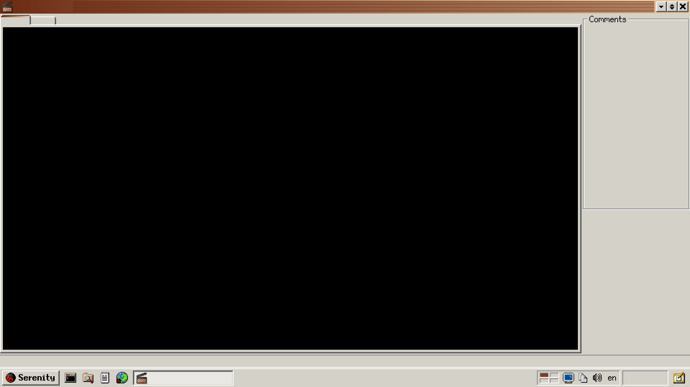
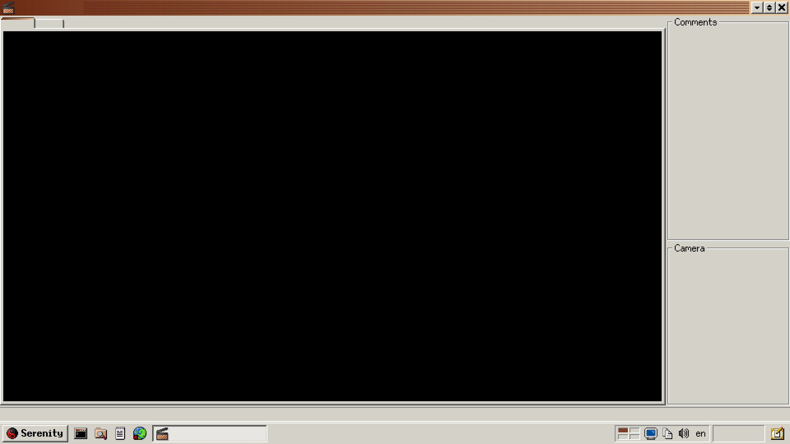

# 90sLiveRoom

仿90年代操作系统风格的直播间界面，目前只做了SerenityOS风格。

## Serenity

仿SerenityOS风格的直播间界面，使用授权与SerenityOS保持一致，即BSD-2-Clause license。

### room.png

1920x1080大小的直播间界面，可以在标题栏，状态栏，任务栏中填入所需文字，任务栏右下角中填入时间。左侧的捕获区域大小为1600x900，右上角有一个Comments栏。

### room-camera.png

追加了Camera栏的变种。

### style.css

仅供参考的[Blivechat](https://github.com/xfgryujk/blivechat)弹幕样式文件，使用了[矢量化的文泉驿点阵宋体](https://github.com/kinamoe/WenQuanYiBitmapSong)